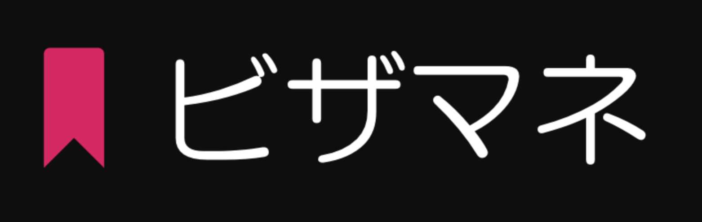

# Visamane
  <br>
  
 


<p>Visamane is a  SpringBoot app to  <strong>.....</strong>.</p>

<br><br>
## Tools

<ul>
<li> SpringBoot </li>
<li> Angular 6 </li>
<li> Spring_Security </li>
<li> Swagger2 </li>
<li> OpenCSV </li>
<li> SuperCSV </li>
</ul>

<br><br>
## New Features

<ul>
<li>  <a href="https://spring.io/guides/gs/accessing-data-rest/">HATEOAS API</a></li>
<li>  <a href="https://github.com/Aymanov1/telegram-community-backend/tree/master/src/main/resources">Spring profiles</a> </li>
<li>  <a href="https://spring.io/projects/spring-security">Spring Security</a></li>
<li>  <a href="https://www.baeldung.com/opencsv">OpenCSV for parsing csv</a></li>
<li>  <a href="https://www.journaldev.com/12021/supercsv-csvbeanreader-cellprocessor-csvbeanwriter">SuperCSV for  parsing csv</a></li>
<li>  <a href="https://swagger.io/docs/">Swagger 2 for API documentation</a></li>
<li> Database backups </li> 
</ul>


<br><br>
## Versions
<ul>
<li>  <a href="./version-1.0.md" target="_blank">Client side version 1.0</a></li>
<li>  <a href="./version-1.1.md" target="_blank">Client side version 1.1</a></li>
<li>  <a href="./version-1.2.md" target="_blank">Client side version 1.2</a></li>
<li>  <a href="./version-1.3.md" target="_blank">Client side version 1.3</a></li>
<li>  <a href="./version-1.4.md" target="_blank">Client side version 1.4</a></li>
<li>  <a href="./version-1.5.md" target="_blank">Client side version 1.5</a></li>

</ul>

<br><br>

**Database Backup:**
```Java
	@PreDestroy
	public void onDestroy() throws Exception {

		// create a backup in case of accident
		try {
			executeCommands();
		} catch (IOException | InterruptedException e1) {
			log.error("error in backup : '{0}'", e1);
		}

	}

	/**
	 * Execute commands using bash. execude a temporary script from java interface
	 *
	 * @throws IOException
	 *             Signals that an I/O exception has occurred.
	 * @throws InterruptedException
	 *             the interrupted exception
	 */
	public void executeCommands() throws IOException, InterruptedException {

		File tempScript = createTempScript();
		try {
			ProcessBuilder pb = new ProcessBuilder("bash", tempScript.toString());
			pb.inheritIO();
			Process process = pb.start();
			process.waitFor();
		} finally {
			tempScript.delete();
		}
	}

	/**
	 * Creates the temp script. the temp script is used to create a backup of
	 * database in case of accident; using pg_dump for postgresql database
	 *
	 * @return the file
	 * @throws IOException
	 *             Signals that an I/O exception has occurred.
	 */
	public File createTempScript() throws IOException {
		File tempScript = File.createTempFile("script", null);

		Writer streamWriter = new OutputStreamWriter(new FileOutputStream(tempScript));
		PrintWriter printWriter = new PrintWriter(streamWriter);
		SimpleDateFormat format = new SimpleDateFormat("yyyy-MM-dd");

		String dateString = format.format(new Date());
		printWriter.println("#!/bin/bash");
		printWriter.println(" PGPASSWORD=\"" + password + "\" pg_dump -U " + username + " "
				+ urlDatabase.substring(urlDatabase.lastIndexOf('/') + 1) + " > " + pathBackup + "/db" + dateString
				+ ".sql");

		printWriter.close();

		return tempScript;
	}

                  
```


## Credits

This software uses code from several open source packages.

- [Journal Dev](https://www.journaldev.com)
- [Baeldung](www.baeldung.com)
- [tutorialspoint](https://www.tutorialspoint.com)

